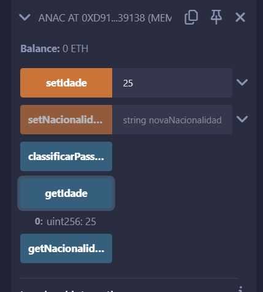
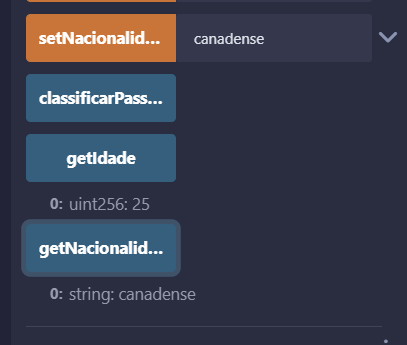
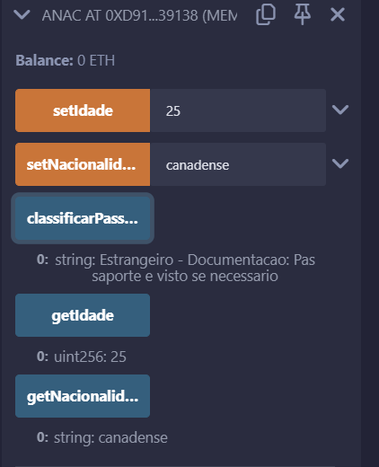
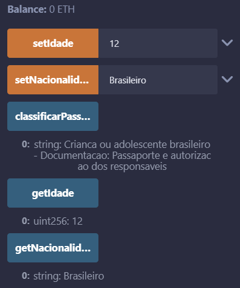
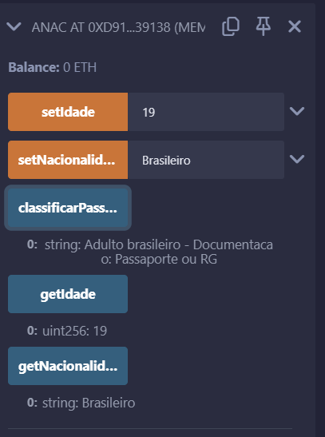
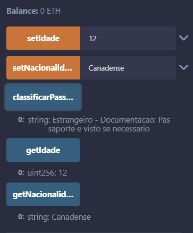

# Ponderada ANAC

Idade padrão é chamada

Em seguida é alterada e chamada novamente para certificar de que a alteração está sendo feita

Em seguida é chamada a nacionalidade padrão

E é realizada a troca de nacionalidade assim como feito com a idade

No panorama geral é possível visualizar que as combinações funcionam brasileiro adulto ou adolescente e estrangeiro adultou ou adolescente. 

O prompt utilizado foi "Preciso de um smart contract em solidity que atenda aos seguintes requisitos: uma variável de estado ao contrato de idade e duas funções getIdade e setIdade para receber os valores de idade." Fiz os testes no código através do Remix ID e pedindo alterações onde achava necessário como o tratamento dos 3 casos também. Eu queria criar documentações mais específicas para cada um dos casos, mas não consegui fazer em tempo hábil. 
